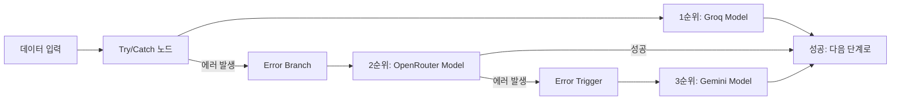

# 🔄 n8n 무료 AI 모델 전환 및 자동 장애 조치 가이드 (2026년 1월 최신판)

이 가이드는 기존 OpenAI(GPT-4o-mini) 기반의 워크플로우를 **완전 무료**이면서도 **고성능**인 최신 AI 모델로 전환하고, 한 모델이 실패했을 때 **자동으로 다른 모델로 넘어가는(Fallback)** 방법을 설명합니다.

---

## 🏆 2026년 무료 AI 모델 추천 리스트 (TOP 5)

귀하의 워크플로우(YouTube 요약)에 적합한 순서대로 정리했습니다. 모든 모델은 **무료 한도 내에서 과금 없이** 중단됩니다.

| 순위  | 모델명                    | 제공처 (방식)            | 무료 한도 (2026.01)  | 특징 & 용도                                                                  |
| :---- | :------------------------ | :----------------------- | :------------------- | :--------------------------------------------------------------------------- |
| **1** | **Llama 3.3 70B**         | **Groq**                 | 일 1,000회+          | **[속도/메인]** 가장 빠르고 한국어 잘함. 기본 모델로 최적.                   |
| **2** | **DeepSeek R1 / V3**      | **OpenRouter**           | 무제한급 (Free 필터) | **[성능/백업]** 추론 능력 최강. 자막이 매우 길거나 복잡할 때 추천.           |
| **3** | **Gemma 2 27B / Phi-4**   | **OpenRouter**           | 무제한급 (Free 필터) | **[경량/백업]** 가볍고 빠름. 단순 요약에 적합하며 안정적임.                  |
| **4** | **Mistral Small 3**       | **Mistral / OpenRouter** | 월 1B 토큰           | **[범용]** 유럽어/영어권 영상 처리에 강점. 코딩 관련 내용 요약 우수.         |
| **5** | **Gemini 2.5 Flash-Lite** | **Google**               | 일 1,500회 (RPM 15)  | **[안정성]** 구글 인프라의 안정감. 한도가 줄었지만 최후의 백업용으로 훌륭함. |

---

## � 자동 장애 조치 (Fallback) 시스템 구축

무료 API는 **일일 한도 초과(Rate Limit)**나 일시적인 **서버 오류**가 발생하기 쉽습니다.
n8n의 **"Error Trigger"** 또는 **"Try/Catch"** 패턴을 사용하면, 첫 번째 모델이 실패했을 때 자동으로 두 번째, 세 번째 모델로 넘어가도록 설정할 수 있습니다.

### 🛡️ 추천 패턴: 3단 방어 구축
1. **1순위**: **Groq (Llama 3.3)** - 가장 빠르고 넉넉함
2. **2순위**: **OpenRouter (DeepSeek R1)** - Groq 실패 시 긴 문맥 처리용으로 전환
3. **3순위**: **Gemini 2.5 Flash-Lite** - 최후의 보루 (구글 인프라 안정성)

### 🛠️ 구현 방법 (Try/Catch 노드 활용)

n8n 캔버스에서 아래 순서대로 노드를 연결하세요.



**상세 설정 단계**:
1. **Node 1**: `Try` 노드를 검색해 추가합니다. 이 노드의 "Try" 출력에 **Groq Chat Model**을 연결합니다.
2. **Node 2**: `Try` 노드의 "Catch" (Error) 출력이 나오면, 여기에 **OpenRouter (HTTP Request 또는 OpenAI 호환 노드)**를 연결합니다.
3. **Node 3 (선택)**: 만약 OpenRouter도 실패할 경우를 대비해, 그 뒤에 **Google Gemini Chat Model**을 연결하여 3중 안전장치를 만듭니다.

---

## 🛠️ 모델별 상세 설정 가이드

### 1. Groq (Llama 3.3) - 1순위
*   **노드**: `Groq Chat Model`
*   **모델명**: `llama-3.3-70b-versatile`
*   **설정**: Temperature 0.6 / Max Tokens 4096

### 2. OpenRouter (DeepSeek / Gemma / Mistral) - 2~4순위
*   **노드**: `OpenAI Chat Model` (호환 모드 사용)
*   **Credentials**:
    *   Type: `OpenAI API`
    *   **Base URL**: `https://openrouter.ai/api/v1` (⚠️ 필수 변경)
    *   API Key: OpenRouter 키 (`sk-or-...`)
*   **모델명 설정 (Model Name)**:
    *   DeepSeek: `deepseek/deepseek-r1:free`
    *   Gemma 2: `google/gemma-2-27b-it:free`
    *   Mistral: `mistralai/mistral-small-24b-instruct-2501:free`
    *   Phi-4: `microsoft/phi-4:free`

### 3. Google Gemini (Flash-Lite) - 5순위
*   **노드**: `Google Gemini Chat Model`
*   **Credentials**: Google Gemini API Key
*   **모델명**: `gemini-2.0-flash-lite-preview-02-05` (또는 최신 버전)

---

## ⚡️ 워크플로우 최적화 팁

### 1. "자막 길이"에 따른 분기 처리 (Switch 노드)
n8n의 **Switch** 노드를 사용하여 자막 글자 수에 따라 모델을 다르게 배정하면 효율적입니다.
- **20,000자 미만**: **Groq (Llama 3.3)** → 속도 최우선
- **20,000자 이상**: **DeepSeek R1** → 긴 문맥(Context Window) 처리 유리

### 2. 프롬프트 강화
Llama 3.3과 DeepSeek은 한국어를 잘하지만, 프롬프트 끝에 **"반드시 한국어로 출력해(Output specifically in Korean)"** 라는 지시를 명확히 넣는 것이 좋습니다.

```plaintext
...
IMPORTANT: Provide the logical summary strictly in Korean language.
```

---

## ❓ 자주 묻는 질문 (FAQ)

**Q. 무료 한도를 넘으면 과금되나요?**
A. 위 목록의 무료 티어(Free Tier)들은 한도 초과 시 **과금되지 않고 에러(429 Code)**를 반환합니다. 따라서 안심하고 자동 전환 로직을 테스트하셔도 됩니다.

**Q. OpenRouter Free 모델은 성능이 떨어지나요?**
A. 아닙니다. OpenRouter의 Free 모델들은 유료 모델과 동일한 성능을 제공하지만, 사용량이 많을 때 대기열(Queue)이 발생할 수 있습니다. 그래서 Groq을 1순위로 두는 것이 좋습니다.
